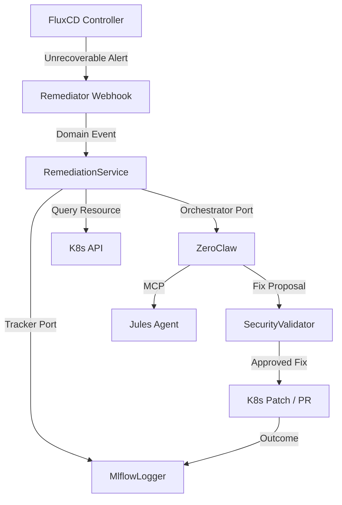

# Data Architecture & Understanding 🏗️

The **Jules Remediator** is built with a **Domain-Driven Design (DDD)** approach, ensuring that the core business logic is isolated from infrastructure specifics.

## 🧱 Architectural Layers

| Layer | Responsibility | Key Components |
| :--- | :--- | :--- |
| **Domain** | Core business entities and rules. | `ClusterError`, `FixProposal`, `SecurityValidator`. |
| **Application** | Use cases and orchestration. | `RemediationWorkflow`, `ProposalService`. |
| **Infrastructure** | Technology-specific implementations. | `K8sClient`, `MlflowLogger`, `JulesDispatcher`. |
| **Interface** | External entry points (Adapters). | `WebhookHandler`, `CLI`. |

## 🔄 End-to-End Data Flow

## 📋 Core Domain Models

### ClusterError

The primary event trigger. It contains the `resource`, `severity`, and `error_code` (e.g., `CrashLoopBackOff`, `ImagePullBackOff`).

- **error_type**: `Transient`, `Permanent`, or `Unknown` (Categorized via DDD logic).

### FixProposal

The output from the Orchestrator.

- `code_change`: The suggested YAML or CLI patch.
- `risk_score`: (Low, Medium, High).
- `confidence`: (0.0 to 1.0).

### RemediationOutcome

The result of an execution attempt, capturing `success` status and `latency_ms` logged via the `Tracker`.

## 🛡️ Persistence & State

- **Stateless Operation**: The Remediator itself is stateless; all state is either in the cluster (K8s API) or in the telemetry system (MLflow).
- **Event-Driven**: It reacts to HTTP webhooks from FluxCD, ensuring near real-time remediation.

> [!NOTE]
> All resource manifests are treated as immutable within a single remediation session to ensure consistency.
