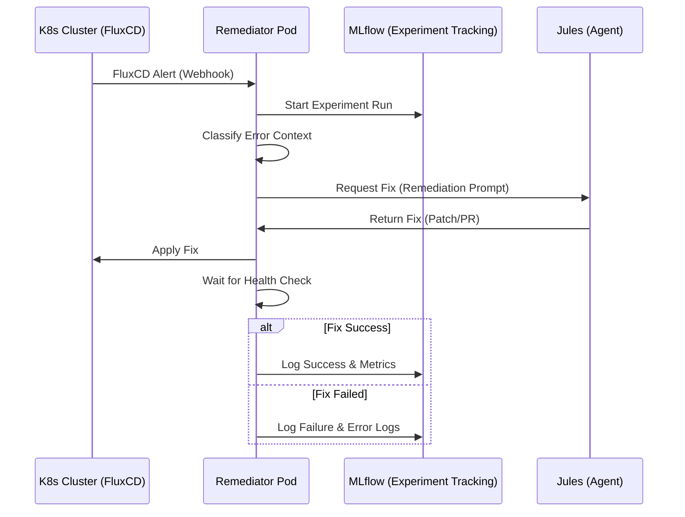

# Remediation Workflow

The remediation process is a closed-loop automation flow between FluxCD, the Remediator Pod, Jules, and MLflow.

## 🛰️ Integration Flow

## 🛠️ Execution Details

### 1. Alert Classification
The Remediator parses the FluxCD alert payload and retrieves additional cluster context (logs, describe output) using the `kubernetes-python-client`.

### 2. Jules Interaction
The system constructs a detailed prompt for Jules, including:
- **Current Cluster State**
- **Error Logs**
- **Attempted Actions History**

### 3. Verification
After applying a fix, the pod monitors the resource's `READY` status for a configurable period (default: 300s) before confirming success.

## 🚀 Proactive Starting Process Control (Controlled Startup)

To prevent "Boot Storms" (high-density pod restarts) during cluster initialization or node reboots, the Jules Remediator implements a proactive, tiered orchestration system.

### 🕵️ Boot Storm Detection
The system monitors all `Started` events across all namespaces. If more than **10 pod starts** are detected within a **60-second window**, Jules enters "Orchestrated Startup" mode.

### 🍱 Tiered Release Strategy
Resources are categorized into four tiers:

| Tier | Name | Target Resources | Strategy |
| :--- | :--- | :--- | :--- |
| **0** | **Bootstrap** | `flux-system/source-controller` | **Foundation Anchor**: Jules ensures this is Ready first. |
| **1** | **Foundation** | SQL DBs, Redis, RabbitMQ, Kafka | **Blocking**: Nothing in Tier 2/3 starts until Tier 1 is >95% Ready. |
| **2** | **Core Services** | Keycloak, Ziti, Prom/Loki/Grafana | **Stabilization**: Active verification of middleware health. |
| **3** | **Applications** | n8n, Flowise, llm-apps, r2r | **Batch Release**: Restored in small batches to avoid CPU saturation. |

### 🧠 Auto-Learning
Jules analyzes historical startup data in SurrealDB. If a pod (e.g. `hatchet`) frequently restarts during startup, the system automatically "promotes" its dependencies or assigns it to a later Tier 3 batch to optimize the flow.

---

**Prepared by:** Antigravity AI
