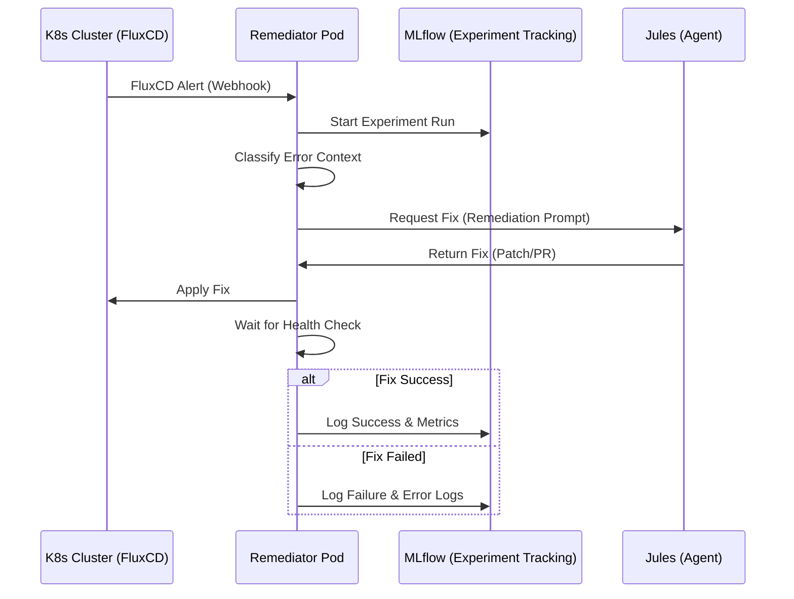

# Remediation Workflow

The remediation process is a closed-loop automation flow between FluxCD, the Remediator Pod, Jules, and MLflow.

## 🛰️ Integration Flow

## 🛠️ Execution Details

### 1. Alert Classification

The Remediator parses the FluxCD alert payload and retrieves additional cluster context (logs, describe output) using the `kube-rs` client. 

**Categorization Logic**:

- **Transient Errors**: (e.g., `ErrImagePull` with network timeout) are logged but skipped to avoid redundant AI calls.
- **Permanent Errors**: (e.g., `OOMKilled`, `CrashLoopBackOff`, `InvalidConfig`) trigger the full Jules remediation loop.
- **Unknown Errors**: Default to remediation if severity is high.

### 2. Jules Interaction

The system constructs a detailed prompt for Jules, including:

- **Current Cluster State**
- **Error Logs**
- **Attempted Actions History**

### 3. Verification

After applying a fix, the pod monitors the resource's `READY` status for a configurable period (default: 300s) before confirming success.
