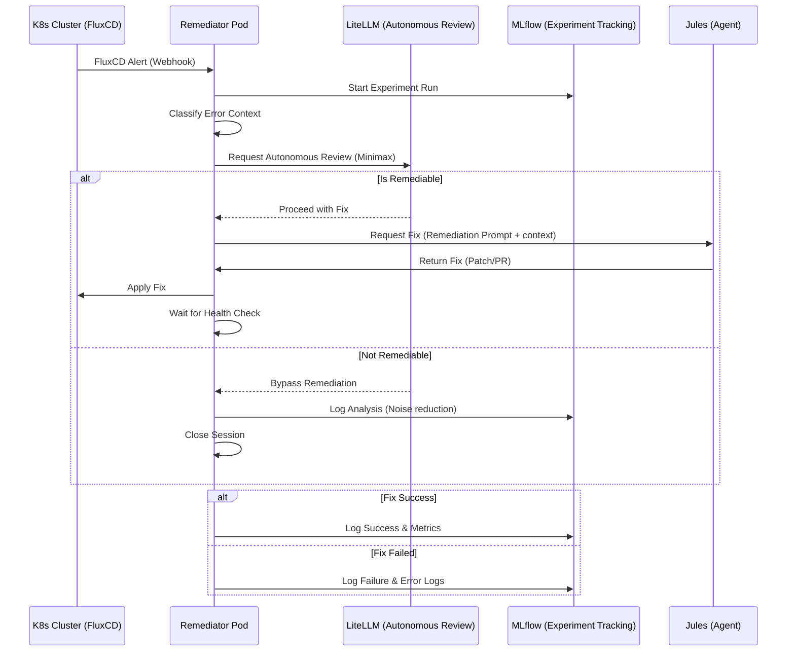

# Remediation Workflow

The remediation process is a closed-loop automation flow between FluxCD, the Remediator Pod, Jules, and MLflow.

## 🛰️ Integration Flow

## 🛠️ Execution Details

### 1. Alert Classification & Startup Check
The Remediator parses the FluxCD alert payload and retrieves additional cluster context. It also checks the "Boot Storm" state to ensure dependencies are ready before attempting any remediation.

### 2. Autonomous Review Phase (New)
Before invoking a full Jules remediation session, the system calls the **LiteLLM Gateway** (model: `minimax-m2.7:cloud`).
- **Goal**: Analyze the error to see if it's transient or if manual intervention is better.
- **Result**: If the model decides an error is not remediable with high confidence, the system stops, preventing unnecessary GitOps noise and MLflow clutter.

### 3. Jules Interaction
If the review approves, the system constructs a detailed prompt for Jules, enriched with the **Autonomous Analysis** results.

### 3. Verification
After applying a fix, the pod monitors the resource's `READY` status for a configurable period (default: 300s) before confirming success.

## 🚀 Proactive Starting Process Control (Controlled Startup)

To prevent "Boot Storms" (high-density pod restarts) during cluster initialization or node reboots, the Jules Remediator implements a proactive, tiered orchestration system.

### 🕵️ Boot Storm Detection
The system monitors all `Started` events across all namespaces. If more than **10 pod starts** are detected within a **60-second window**, Jules enters "Orchestrated Startup" mode.

### 🍱 Tiered Release Strategy
Resources are categorized into four tiers:

| Tier | Name | Target Resources | Strategy |
| :--- | :--- | :--- | :--- |
| **0** | **Bootstrap** | `flux-system/source-controller` | **Foundation Anchor**: Jules ensures this is Ready first. |
| **1** | **Foundation** | SQL DBs, Redis, RabbitMQ, Kafka | **Blocking**: Nothing in Tier 2/3 starts until Tier 1 is >95% Ready. |
| **2** | **Core Services** | Keycloak, Ziti, Prom/Loki/Grafana | **Stabilization**: Active verification of middleware health. |
| **3** | **Applications** | n8n, Flowise, llm-apps, r2r | **Batch Release**: Restored in small batches to avoid CPU saturation. |

### 🧠 Auto-Learning
Jules analyzes historical startup data in SurrealDB. If a pod (e.g. `hatchet`) frequently restarts during startup, the system automatically "promotes" its dependencies or assigns it to a later Tier 3 batch to optimize the flow.

## 🧹 Stability-Based Cleanup (Self-Purge)

Once the system is declared **Stable** (either through the 10-minute stabilization window or after a completed tiered orchestration), the Jules Remediator performs a final cleanup of the environment.

### 🎯 Objective: Resetting the Baseline
Any pods that failed during the startup process (e.g., those that hit `CrashLoopBackOff` while waiting for a dependency) might remain in the cluster in a degraded state even after the system is healthy.

### ⚙️ Mechanics
1. **Identification**: The system scans all namespaces for pods in `Failed` phase or those with container statuses indicating error states (e.g., `Error`, `CrashLoopBackOff`, `ImagePullBackOff`).
2. **Execution**: These pods are deleted.
3. **Reset**: Kubernetes controllers (Deployments/StatefulSets) automatically recreate the pods. Since these are new pods, their **restart counts** are reset to zero, providing a clean operational baseline.
4. **Throttle**: This operation is performed **exactly once** per system restart to prevent recursive cleanup loops.

---

**Prepared by:** Antigravity AI
