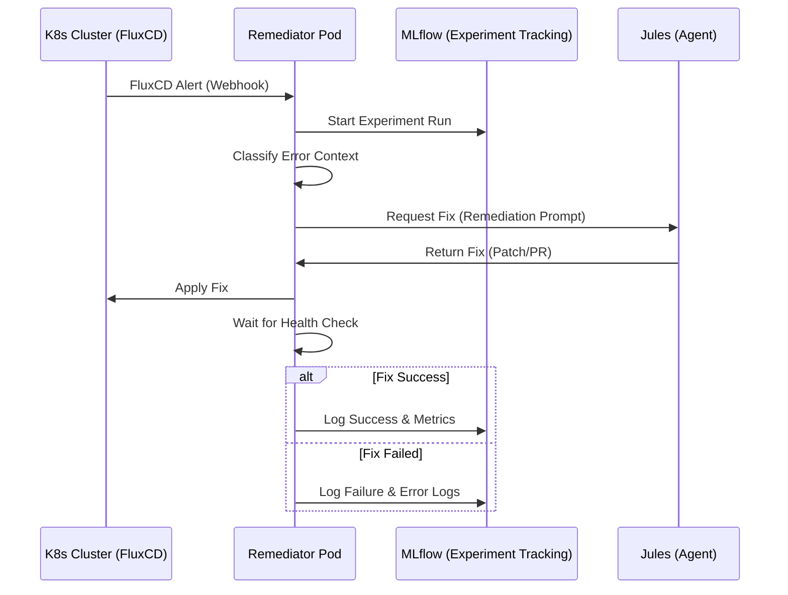

# Remediation Workflow

The remediation process is a closed-loop automation flow between FluxCD, the Remediator Pod, Jules, and MLflow.

## 🛰️ Integration Flow

## 🛠️ Execution Details

### 1. Alert Classification
The Remediator parses the FluxCD alert payload and retrieves additional cluster context (logs, describe output) using the `kubernetes-python-client`.

### 2. Jules Interaction
The system constructs a detailed prompt for Jules, including:
- **Current Cluster State**
- **Error Logs**
- **Attempted Actions History**

### 3. Verification
After applying a fix, the pod monitors the resource's `READY` status for a configurable period (default: 300s) before confirming success.

## 🚀 Starting Process Control (Zero Restart Guarantee)

To prevent `CrashLoopBackOff` events during cluster startup, the Remediator implements an active orchestration loop.

### The Problem
In distributed systems, application pods often start before their dependencies (e.g., Databases, Message Brokers), leading to container restarts and increased system load during initialization.

### The Solution: Active Dependency Polling
The `StartupMonitor` uses a dual-layer verification strategy:
1. **Live K8s API Check**: Directly queries pods in the namespace to verify the `Ready` condition.
2. **Event Timeline Heuristic**: Falls back to an internal persistence layer (SurrealDB) that tracks historic startup events if live data is definitive.

### The Monitoring Task
When an error is detected during the startup phase:
- **Pause**: The resource is scaled to 0 components to stop restart loops.
- **Poll**: The `RemediationWorkflow` enters a polling loop (30s interval, 5m timeout), querying the `StartupMonitor` for dependency readiness.
- **Resume**: Once dependencies are 'Ready', the resource is scaled back up.
- **Verify**: A 15-second stability check is performed post-resumption to ensure zero subsequent restarts.
