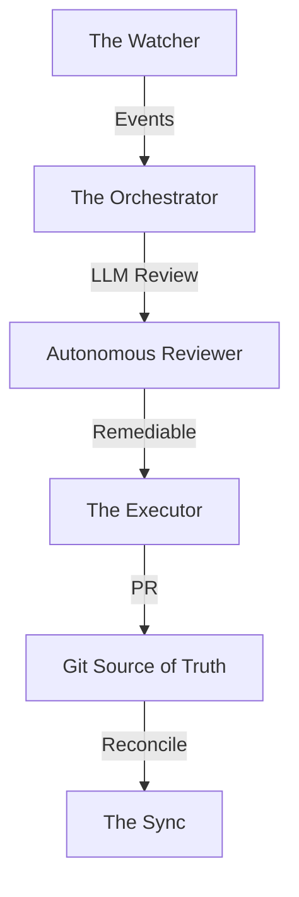

# Solution Architecture: The Dark System 🌑

**Project Aethelgard** implements a **Decoupled Event-Driven Controller** architecture, often referred to as a "Dark System" because it operates silently and autonomously to maintain the cluster's "Source of Truth" in Git.

## 🏗️ Architectural Components

| Component | Role | Technology |
| :--- | :--- | :--- |
| **The Watcher** | Real-time observation of K8s events. | Rust / `kube-rs` |
| **StartupMonitor** | Proactive dependency tracking & tiered orchestration. | Rust / `kube-rs` / SurrealDB |
| **The Orchestrator** | Error translation & prompt engineering. | Rust / **ZeroClaw** (MCP Host) |
| **Autonomous Reviewer**| Intelligent error filtering & analysis. | Rust / **LiteLLM** (Minimax) |
| **The Executor** | Code modification & validation. | Remote AI / **Jules (MCP)** |
| **The Sync** | Cluster state reconciliation. | **FluxCD** (GitOps) |
| **Stability Cleaner** | Post-stabilization pod cleanup & restart reset. | Rust / `kube-rs` |

## 🧱 DDD Layered Design

The system adheres to **Domain-Driven Design (DDD)** to ensure stability and separation of concerns.

### 1. Domain Layer (`/src/domain`)
The core of the system. It contains:
- **Entities**: `RemediationTask`, `ClusterAlert`.
- **Value Objects**: `ErrorClassification`, `FixProposal`.
- **Domain Services**: Logic for determining if an error is fixable.
- **Rules**: Pure business rules (no external dependencies).

### 2. Application Layer (`/src/application`)
Orchestrates the use cases. It coordinates the business logic:
- **Use Cases**: `ProcessAlertUseCase`, `ExecuteFixUseCase`.
- **Port Definitions**: Interfaces for repositories and external services (e.g., `IMLflowTracker`, `IKubernetesClient`).

### 3. Infrastructure Layer (`/src/infrastructure`)
Concrete implementations:
- **ZeroClaw (Orchestrator)**: The Rust-based MCP host that bridges the cluster and Jules.
- **MLflow / OpenTelemetry**: Tracking metrics and traces.
- **Persistence**: SQLite/SurrealDB for local MLOps tracking.

### 4. Interface Layer (`/src/interface`)
- **Webhook API**: Receives FluxCD alerts.
- **MCP Bridge**: Communication over STDIO/HTTP for Jules integration.

## 🧩 Dependency Rule
Dependencies only point **inward**. The Domain layer knows nothing about the Infrastructure layer.

