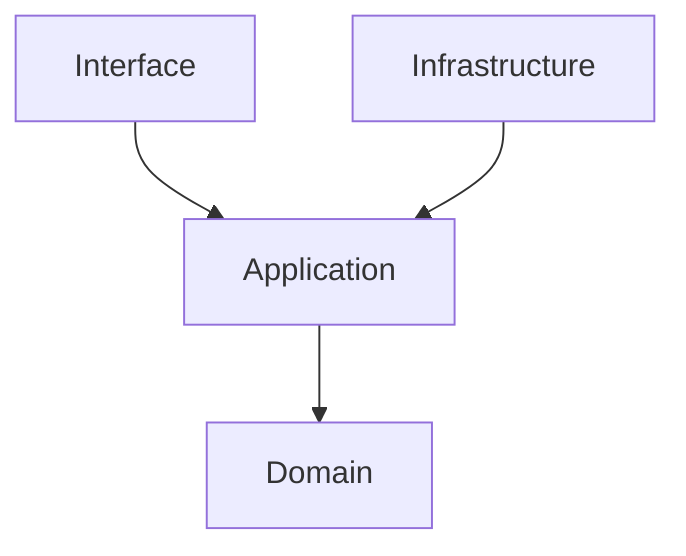

# Solution Architecture (DDD)

The **Jules Remediator** is structured following strict **Domain-Driven Design (DDD)** principles to ensure that the core remediation logic remains independent of underlying technologies.

## 🏗️ Architecture Layers

### 1. Domain Layer (`/src/domain`)
The core of the system. It contains:
- **Entities**: `RemediationTask`, `ClusterAlert`.
- **Value Objects**: `ErrorClassification`, `FixProposal`.
- **Domain Services**: Logic for determining if an error is fixable.
- **Rules**: Pure business rules (no external dependencies).

### 2. Application Layer (`/src/application`)
Orchestrates the use cases. It coordinates the business logic:
- **Use Cases**: `ProcessAlertUseCase`, `ExecuteFixUseCase`.
- **Port Definitions**: Interfaces for repositories and external services (e.g., `IMLflowTracker`, `IKubernetesClient`).

### 3. Infrastructure Layer (`/src/infrastructure`)
Concrete implementations of technology-specific logic:
- **K8s Client**: Real implementation of cluster interactions.
- **MLflow Tracking**: Integration with the MLOps monitoring stack.
- **Persistence**: GitOps/PR creation logic.

### 4. Interface Layer (`/src/interface`)
The external communication boundaries:
- **Webhook API**: Receives FluxCD alerts.
- **CLI**: Manual trigger for remediation tasks.
- **API**: Monitoring endpoints.

## 🧩 Dependency Rule
Dependencies only point **inward**. The Domain layer knows nothing about the Infrastructure layer.

